# Entity Relationship (ER) Diagram & Schema Guide — Unifiedtransform

This document provides a complete technical guide to the database architecture of **Unifiedtransform**. It includes the ER diagram, detailed table schemas, primary and foreign key relationships, Eloquent model access patterns, and HTTP Controller/Route mapping.

---

## 1. High-Level Architecture & ER Diagram

```mermaid
erDiagram

    %% --- USER MANAGEMENT & ROLES ---
    users ||--o| student_parent_infos : "has parent info"
    users ||--o| student_academic_infos : "has academic info"
    users ||--o{ model_has_roles : "assigned role"
    roles ||--o{ model_has_roles : "role definition"
    roles ||--o{ role_has_permissions : "role permissions"
    permissions ||--o{ role_has_permissions : "permission definition"

    %% --- ACADEMIC STRUCTURE ---
    school_sessions ||--o{ semesters : "contains"
    school_sessions ||--o{ school_classes : "contains"
    school_classes ||--o{ sections : "has sections"
    school_classes ||--o{ courses : "offers courses"
    semesters ||--o{ courses : "belongs to semester"

    %% --- ACADEMIC ALLOCATIONS & ENROLLMENT ---
    users ||--o{ promotions : "enrolled student"
    school_classes ||--o{ promotions : "class"
    sections ||--o{ promotions : "section"
    school_sessions ||--o{ promotions : "session"

    users ||--o{ assigned_teachers : "assigned teacher"
    school_classes ||--o{ assigned_teachers : "class"
    sections ||--o{ assigned_teachers : "section"
    courses ||--o{ assigned_teachers : "course"

    %% --- DAILY ACADEMICS ---
    users ||--o{ attendances : "student attendance"
    courses ||--o{ attendances : "course attendance"
    school_classes ||--o{ attendances : "class attendance"
    sections ||--o{ attendances : "section attendance"

    school_classes ||--o{ routines : "class routine"
    sections ||--o{ routines : "section routine"
    courses ||--o{ routines : "course routine"

    school_classes ||--o{ syllabi : "class syllabus"
    courses ||--o{ syllabi : "course syllabus"

    users ||--o{ assignments : "teacher assignment upload"
    courses ||--o{ assignments : "course assignment"

    %% --- EXAMS & GRADING ---
    semesters ||--o{ exams : "semester exam"
    school_classes ||--o{ exams : "class exam"
    courses ||--o{ exams : "course exam"

    exams ||--o{ exam_rules : "exam rule"

    school_classes ||--o{ grading_systems : "class grading"
    semesters ||--o{ grading_systems : "semester grading"
    grading_systems ||--o{ grade_rules : "grade rules"

    users ||--o{ marks : "student marks"
    exams ||--o{ marks : "exam marks"
    courses ||--o{ marks : "course marks"

    users ||--o{ final_marks : "student final mark"
    courses ||--o{ final_marks : "course final mark"

    %% --- ANNOUNCEMENTS & CALENDAR ---
    school_sessions ||--o{ notices : "session notices"
    school_sessions ||--o{ events : "session events"
```



---

## 2. Comprehensive Database Table Breakdown

Below is the detailed specification of all database tables in the application.

### A. User Management & Authentication

#### 1. `users`
Central user table storing students, teachers, parents, and administrative staff.
- **Model**: `App\Models\User`
- **Fields**:
  - `id` (bigint, PK, Auto-Increment)
  - `first_name` (string)
  - `last_name` (string)
  - `email` (string, Unique)
  - `gender` (string)
  - `nationality` (string)
  - `phone` (string)
  - `address` (string)
  - `address2` (string)
  - `city` (string)
  - `zip` (string)
  - `photo` (string, Nullable) — Path to avatar image
  - `birthday` (string, Nullable)
  - `blood_type` (string, Nullable)
  - `religion` (string, Nullable)
  - `role` (string) — e.g. `'student'`, `'teacher'`, `'admin'`
  - `email_verified_at` (timestamp, Nullable)
  - `password` (string, Hashed)
  - `remember_token` (string, Nullable)
  - `created_at`, `updated_at` (timestamps)

#### 2. `student_parent_infos`
Parent / Guardian contact details linked to a student.
- **Model**: `App\Models\StudentParentInfo`
- **Fields**:
  - `id` (bigint, PK)
  - `student_id` (unsignedInt, FK -> `users.id`)
  - `father_name` (string)
  - `father_phone` (string)
  - `mother_name` (string)
  - `mother_phone` (string)
  - `parent_address` (string)
  - `created_at`, `updated_at`

#### 3. `student_academic_infos`
Board registration details for students.
- **Model**: `App\Models\StudentAcademicInfo`
- **Fields**:
  - `id` (bigint, PK)
  - `student_id` (unsignedInt, FK -> `users.id`)
  - `board_reg_no` (string, Nullable)
  - `created_at`, `updated_at`

---

### B. Core Academic Structure

#### 4. `school_sessions`
Academic years / sessions (e.g. `2025-2026`).
- **Model**: `App\Models\SchoolSession`
- **Fields**:
  - `id` (bigint, PK)
  - `session_name` (string)
  - `created_at`, `updated_at`

#### 5. `semesters`
Semesters within an academic session.
- **Model**: `App\Models\Semester`
- **Fields**:
  - `id` (bigint, PK)
  - `semester_name` (string)
  - `start_date` (date)
  - `end_date` (date)
  - `session_id` (unsignedInt, FK -> `school_sessions.id`)
  - `created_at`, `updated_at`

#### 6. `school_classes`
Classes / Grades (e.g. `Class 10`).
- **Model**: `App\Models\SchoolClass`
- **Fields**:
  - `id` (bigint, PK)
  - `class_name` (string)
  - `session_id` (unsignedInt, FK -> `school_sessions.id`)
  - `created_at`, `updated_at`

#### 7. `sections`
Sections under a class (e.g. `Section A`, `Room 102`).
- **Model**: `App\Models\Section`
- **Fields**:
  - `id` (bigint, PK)
  - `section_name` (string)
  - `room_no` (string)
  - `class_id` (unsignedInt, FK -> `school_classes.id`)
  - `session_id` (unsignedInt, FK -> `school_sessions.id`)
  - `created_at`, `updated_at`

#### 8. `courses`
Subjects or Courses taught in a class and semester.
- **Model**: `App\Models\Course`
- **Fields**:
  - `id` (bigint, PK)
  - `course_name` (string)
  - `course_type` (string) — Theory / Practical / Elective
  - `class_id` (unsignedInt, FK -> `school_classes.id`)
  - `semester_id` (unsignedInt, FK -> `semesters.id`)
  - `session_id` (unsignedInt, FK -> `school_sessions.id`)
  - `created_at`, `updated_at`

#### 9. `promotions`
Student enrollment and class promotion tracking.
- **Model**: `App\Models\Promotion`
- **Fields**:
  - `id` (bigint, PK)
  - `student_id` (unsignedInt, FK -> `users.id`)
  - `class_id` (unsignedInt, FK -> `school_classes.id`)
  - `section_id` (unsignedInt, FK -> `sections.id`)
  - `session_id` (unsignedInt, FK -> `school_sessions.id`)
  - `id_card_number` (string)
  - `created_at`, `updated_at`

#### 10. `assigned_teachers`
Teacher subject-class assignment matrix.
- **Model**: `App\Models\AssignedTeacher`
- **Fields**:
  - `id` (bigint, PK)
  - `teacher_id` (unsignedInt, FK -> `users.id`)
  - `semester_id` (unsignedInt, FK -> `semesters.id`)
  - `class_id` (unsignedInt, FK -> `school_classes.id`)
  - `section_id` (unsignedInt, FK -> `sections.id`)
  - `course_id` (unsignedInt, FK -> `courses.id`)
  - `session_id` (unsignedInt, FK -> `school_sessions.id`)
  - `created_at`, `updated_at`

---

### C. Attendance & Daily Academics

#### 11. `attendances`
Records of student attendance (section-wise or course-wise).
- **Model**: `App\Models\Attendance`
- **Fields**:
  - `id` (bigint, PK)
  - `student_id` (unsignedInt, FK -> `users.id`)
  - `class_id` (unsignedInt, default 0, FK -> `school_classes.id`)
  - `section_id` (unsignedInt, default 0, FK -> `sections.id`)
  - `course_id` (unsignedInt, default 0, FK -> `courses.id`)
  - `status` (string) — e.g. `'present'`, `'absent'`, `'late'`
  - `session_id` (unsignedInt, FK -> `school_sessions.id`)
  - `created_at`, `updated_at`

#### 12. `routines`
Class weekly timetables.
- **Model**: `App\Models\Routine`
- **Fields**:
  - `id` (bigint, PK)
  - `start` (string) — e.g. `'09:00 AM'`
  - `end` (string) — e.g. `'10:00 AM'`
  - `weekday` (int) — 1 to 7 (Monday-Sunday)
  - `class_id` (unsignedInt, FK -> `school_classes.id`)
  - `section_id` (unsignedInt, FK -> `sections.id`)
  - `course_id` (unsignedInt, FK -> `courses.id`)
  - `session_id` (unsignedInt, FK -> `school_sessions.id`)
  - `created_at`, `updated_at`

#### 13. `syllabi`
Uploaded course syllabus documents.
- **Model**: `App\Models\Syllabus`
- **Fields**:
  - `id` (bigint, PK)
  - `syllabus_name` (string)
  - `syllabus_file_path` (string)
  - `class_id` (unsignedInt, FK -> `school_classes.id`)
  - `course_id` (unsignedInt, FK -> `courses.id`)
  - `session_id` (unsignedInt, FK -> `school_sessions.id`)
  - `created_at`, `updated_at`

#### 14. `assignments`
Homework and assignments created by teachers.
- **Model**: `App\Models\Assignment`
- **Fields**:
  - `id` (bigint, PK)
  - `teacher_id` (unsignedInt, FK -> `users.id`)
  - `semester_id` (unsignedInt, FK -> `semesters.id`)
  - `class_id` (unsignedInt, FK -> `school_classes.id`)
  - `section_id` (unsignedInt, FK -> `sections.id`)
  - `course_id` (unsignedInt, FK -> `courses.id`)
  - `session_id` (unsignedInt, FK -> `school_sessions.id`)
  - `assignment_name` (string)
  - `assignment_file_path` (string)
  - `created_at`, `updated_at`

---

### D. Exams, Marks & Grading

#### 15. `exams`
Scheduled examinations.
- **Model**: `App\Models\Exam`
- **Fields**:
  - `id` (bigint, PK)
  - `exam_name` (string)
  - `start_date` (dateTime)
  - `end_date` (dateTime)
  - `semester_id` (unsignedInt, FK -> `semesters.id`)
  - `class_id` (unsignedInt, FK -> `school_classes.id`)
  - `course_id` (unsignedInt, FK -> `courses.id`)
  - `session_id` (unsignedInt, FK -> `school_sessions.id`)
  - `created_at`, `updated_at`

#### 16. `exam_rules`
Exam scoring configurations.
- **Model**: `App\Models\ExamRule`
- **Fields**:
  - `id` (bigint, PK)
  - `exam_id` (unsignedInt, FK -> `exams.id`)
  - `total_marks` (float)
  - `pass_marks` (float)
  - `marks_distribution_note` (text)
  - `session_id` (unsignedInt, FK -> `school_sessions.id`)
  - `created_at`, `updated_at`

#### 17. `marks`
Individual student scores for specific exams.
- **Model**: `App\Models\Mark`
- **Fields**:
  - `id` (bigint, PK)
  - `student_id` (unsignedInt, FK -> `users.id`)
  - `class_id` (unsignedInt, FK -> `school_classes.id`)
  - `section_id` (unsignedInt, FK -> `sections.id`)
  - `course_id` (unsignedInt, FK -> `courses.id`)
  - `exam_id` (unsignedInt, FK -> `exams.id`)
  - `session_id` (unsignedInt, FK -> `school_sessions.id`)
  - `marks` (float, default 0)
  - `created_at`, `updated_at`

#### 18. `grading_systems`
Grading system profiles per class/semester.
- **Model**: `App\Models\GradingSystem`
- **Fields**:
  - `id` (bigint, PK)
  - `system_name` (string)
  - `class_id` (unsignedInt, FK -> `school_classes.id`)
  - `semester_id` (unsignedInt, FK -> `semesters.id`)
  - `session_id` (unsignedInt, FK -> `school_sessions.id`)
  - `created_at`, `updated_at`

#### 19. `grade_rules`
Score ranges and letter grades/GPA points for a grading system.
- **Model**: `App\Models\GradeRule`
- **Fields**:
  - `id` (bigint, PK)
  - `grading_system_id` (unsignedInt, FK -> `grading_systems.id`)
  - `point` (float) — e.g. `4.0`
  - `grade` (string) — e.g. `'A+'`
  - `start_at` (float) — Lower score bound (e.g. `80`)
  - `end_at` (float) — Upper score bound (e.g. `100`)
  - `session_id` (unsignedInt, FK -> `school_sessions.id`)
  - `created_at`, `updated_at`

#### 20. `final_marks`
Calculated cumulative marks and final grade records.
- **Model**: `App\Models\FinalMark`
- **Fields**:
  - `id` (bigint, PK)
  - `student_id` (unsignedInt, FK -> `users.id`)
  - `class_id` (unsignedInt, FK -> `school_classes.id`)
  - `section_id` (unsignedInt, FK -> `sections.id`)
  - `course_id` (unsignedInt, FK -> `courses.id`)
  - `semester_id` (unsignedInt, FK -> `semesters.id`)
  - `session_id` (unsignedInt, FK -> `school_sessions.id`)
  - `calculated_marks` (float, default 0)
  - `final_marks` (float, default 0)
  - `note` (text, Nullable)
  - `created_at`, `updated_at`

---

### E. Events, Notices & System Settings

#### 21. `notices`
Noticeboard posts for a session.
- **Model**: `App\Models\Notice`
- **Fields**: `id`, `notice` (text), `session_id`, `created_at`, `updated_at`

#### 22. `events`
School calendar events.
- **Model**: `App\Models\Event`
- **Fields**: `id`, `title` (string), `start` (dateTime), `end` (dateTime), `session_id`, `created_at`, `updated_at`

#### 23. `academic_settings`
Global academic toggle switches.
- **Model**: `App\Models\AcademicSetting`
- **Fields**:
  - `id` (bigint, PK)
  - `attendance_type` (string, default `'section'`) — `'section'` or `'course'`
  - `marks_submission_status` (string, default `'off'`) — `'on'` or `'off'`
  - `created_at`, `updated_at`

---

### F. Permissions & System Infrastructure

#### 24. Spatie Permission Tables
- `roles`: `id`, `name`, `guard_name`, `created_at`, `updated_at`
- `permissions`: `id`, `name`, `guard_name`, `created_at`, `updated_at`
- `model_has_roles`: `role_id`, `model_type`, `model_id`
- `model_has_permissions`: `permission_id`, `model_type`, `model_id`
- `role_has_permissions`: `permission_id`, `role_id`

#### 25. System Utility Tables
- `password_resets`: `email`, `token`, `created_at`
- `failed_jobs`: `id`, `uuid`, `connection`, `queue`, `payload`, `exception`, `failed_at`

---

## 3. How to Access and Query These Tables

### A. Access via Eloquent Models (PHP Code)

You can query, insert, and modify tables using standard Laravel Eloquent models defined in `app/Models/`.

#### 1. Fetching Users with Relationships
```php
use App\Models\User;

// Get a student along with parent & academic info
$student = User::with(['parent_info', 'academic_info', 'marks'])->find($studentId);

// Filter users by role
$teachers = User::where('role', 'teacher')->get();
$students = User::role('student')->get(); // Using Spatie HasRoles trait
```

#### 2. Querying Attendance Records
```php
use App\Models\Attendance;

// Fetch attendance for a specific section and session
$attendances = Attendance::where('class_id', $classId)
    ->where('section_id', $sectionId)
    ->where('session_id', $sessionId)
    ->with('student')
    ->get();

// Record attendance
Attendance::create([
    'student_id' => 5,
    'class_id'   => 1,
    'section_id' => 2,
    'course_id'  => 0,
    'session_id' => 1,
    'status'     => 'present',
]);
```

#### 3. Course Allocations & Teacher Assignments
```php
use App\Models\AssignedTeacher;

$assignments = AssignedTeacher::with(['teacher', 'schoolClass', 'section', 'course'])
    ->where('teacher_id', $teacherId)
    ->get();
```

#### 4. Managing Marks & Final Grades
```php
use App\Models\Mark;
use App\Models\FinalMark;

// Save student exam score
Mark::updateOrCreate(
    ['student_id' => $studentId, 'exam_id' => $examId, 'course_id' => $courseId],
    ['marks' => 88.5, 'class_id' => $classId, 'section_id' => $sectionId, 'session_id' => $sessionId]
);

// Submit final mark
FinalMark::create([
    'calculated_marks' => 88.5,
    'final_marks'      => 90.0,
    'note'             => 'Bonus points added for attendance',
    'student_id'       => $studentId,
    'class_id'         => $classId,
    'section_id'       => $sectionId,
    'course_id'        => $courseId,
    'semester_id'      => $semesterId,
    'session_id'       => $sessionId,
]);
```

---

### B. Access via Direct Database Queries (DB Facade)

For complex multi-table joins or bulk operations, use `Illuminate\Support\Facades\DB`:

```php
use Illuminate\Support\Facades\DB;

$results = DB::table('marks')
    ->join('users', 'marks.student_id', '=', 'users.id')
    ->join('courses', 'marks.course_id', '=', 'courses.id')
    ->select('users.first_name', 'users.last_name', 'courses.course_name', 'marks.marks')
    ->where('marks.class_id', 1)
    ->get();
```

---

### C. Web HTTP Routes & Controller Mapping

Below is a quick reference mapping front-end/API actions to their Controllers and underlying tables:

| Action / Feature | Route / Endpoint | Controller Method | Target Table(s) |
| :--- | :--- | :--- | :--- |
| **Manage Sessions** | `POST /school/session/create` | `SchoolSessionController@store` | `school_sessions` |
| **Manage Classes** | `POST /school/class/create` | `SchoolClassController@store` | `school_classes` |
| **Manage Sections** | `POST /school/section/create` | `SectionController@store` | `sections` |
| **Manage Courses** | `POST /school/course/create` | `CourseController@store` | `courses` |
| **Teacher Creation** | `POST /school/teacher/create` | `UserController@storeTeacher` | `users`, `model_has_roles` |
| **Teacher Assignment** | `POST /school/teacher/assign` | `AssignedTeacherController@store` | `assigned_teachers` |
| **Student Creation** | `POST /school/student/create` | `UserController@storeStudent` | `users`, `student_parent_infos`, `student_academic_infos` |
| **Student Promotion** | `POST /promotions/promote` | `PromotionController@store` | `promotions` |
| **Mark Attendance** | `POST /attendances` | `AttendanceController@store` | `attendances` |
| **Record Marks** | `POST /marks/store` | `MarkController@store` | `marks` |
| **Final Grade Submit**| `POST /marks/final/submit` | `MarkController@storeFinalMark` | `final_marks` |
| **Exams & Rules** | `POST /exams/create`, `/exams/add-rule` | `ExamController`, `ExamRuleController` | `exams`, `exam_rules` |
| **Grading Rules** | `POST /exams/grade/add-rule` | `GradeRuleController@store` | `grading_systems`, `grade_rules` |
| **Assignments** | `POST /courses/assignments/create` | `AssignmentController@store` | `assignments` |
| **Syllabus** | `POST /syllabus/create` | `SyllabusController@store` | `syllabi` |

---

### D. Direct Database Access (Terminal / Artisan CLI)

If running within the environment or container:

1. **Interactive PHP Shell (Laravel Tinker)**:
   ```bash
   php artisan tinker
   ```
   Example tinker commands:
   ```php
   >>> App\Models\User::count();
   >>> App\Models\Attendance::where('status', 'absent')->get();
   ```

2. **MySQL Command Line**:
   ```bash
   mysql -u root -p unifiedtransform
   ```

3. **Running Migrations & Seeders**:
   ```bash
   php artisan migrate
   php artisan db:seed
   ```
